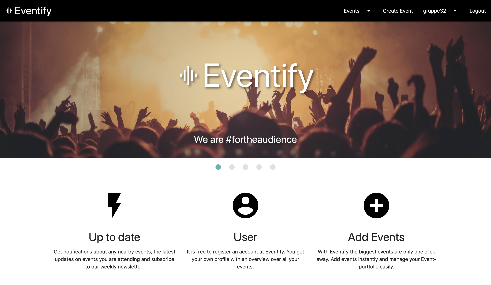
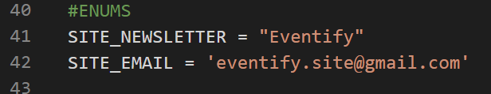

## Eventify <a href="https://gitlab.stud.idi.ntnu.no/programvareutvikling-v19/gruppe-32/-/jobs" rel="nofollow"></a>

Eventify is an event platform where you can make your own events and attend others events. The platform should also give the user an easy way to keep track of future events you are attending. Further it was a priority from the customer that security should be taken care of.


## Motivation

This project was a part of our submission in the subject TDT4140 Programvareutvikling. Our product owner is Eventify and they wanted us to make a fully functional event platform.


## Techonology stack

#### Frameworks:

<ul>
<li><a href="https://www.djangoproject.com/" rel="nofollow">Django</a> - Web framework for Python</li>
<li><a href="https://www.postgresql.org/" rel="nofollow">PostgreSQL</a> - Database</li>
<li><a href="https://materializecss.com/" rel="nofollow">Materialize CSS</a> - Front-end framework</li>
<li><a href="https://pypi.org/project/django-bootstrap4/" rel="nofollow">Bootstrap 4</a> - CSS framework</li>
</ul>

#### Dependencies:

* numpy 
* pyserial 
* pytz 
* psycopg2 
* gunicorn 
* dj-database-url 
* whitenoise 
* Pillow 
* django-newsletter

## Features

* Cross-platform
* User authentication
* Customizable newsletters
* Broadcast events
* Attend events

## Django directory structure
```
├── manage.py
├── eventifySite
│   ├── __init__.py
│   ├── settings.py
│   ├── urls.py
│   └── wsgi.py
└── main
    ├── admin.py
    ├── apps.py
    ├── forms.py
    ├── migrations
    │   └── . . .
    ├── models.py
    ├── static
    │   └── main
    │       ├── css
    │       │   └── . . .
    │       ├── fonts
    │       │   └── . . .
    │       ├── images
    │       │   └── . . .
    │       └── js
    │           └── . . .
    ├── templates
    │   ├── main
    │   │   └── . . .
    │   └── registration
    │       └── . . .
    ├── tests
    │   └── . . .
    ├── urls.py
    └── views.py
```


## Development setup

* Install postgreSQL from <a href="https://www.postgresql.org/download/" rel="nofollow">here</a>

* *(Recommended)* Setup virtualenv

* Install requirements:

    * `$ pip install -r requirements.txt`

* Configure `django-newsletter`:

    In views.py `SITE_NEWSLETTER` and `SITE_EMAIL` are set by default to:
    
    ```
    SITE_NEWSLETTER = 'Eventify'
    SITE_EMAIL = 'eventify.site@gmail.com'
    ```
    
    These can be changed by choice. The values declare the name and email for the sites newsletter.
    
    
    
* SMTP setup / Email backend:

    To send mail, django-newsletter uses Django-provided email utilities, so ensure that email settings are properly configured for your project.
    The utilities are set by default, but must be configured in `./eventifySite/settings.py`
    
    ```
    EMAIL_HOST = 'localhost'    # The host to use for sending email i.e. gmail, outlook, etc.
        
    EMAIL_PORT = 25             # Port to use for the SMTP server defined in EMAIL_HOST.
        
    EMAIL_USER = ' '            # Username to use for the SMTP server defined in EMAIL_HOST. If empty, Django won’t attempt authentication.
        
    EMAIL_HOST_PASSWORD = ' '   # Password to use for the SMTP server defined in EMAIL_HOST. This setting is used in conjunction with 
                                # EMAIL_HOST_USER when authenticating to the SMTP server. If either of these settings is empty, 
                                # Django won’t attempt authentication.
          
    EMAIL_USE_TLS = False       # Whether to use a TLS (secure) connection when talking to the SMTP server. This is used for explicit 
                                # TLS connections, generally on port 587. If you are experiencing hanging connections, see the implicit 
                                # TLS setting EMAIL_USE_SSL.
          
    EMAIL_USE_SSL = False       # Whether to use an implicit TLS (secure) connection when talking to the SMTP server. In most email 
                                # documentation this type of TLS connection is referred to as SSL. It is generally used on port 465. 
                                # If you are experiencing problems, see the explicit TLS setting EMAIL_USE_TLS.
    ```
* Start server:

    * `$ python manage.py runserver`

* Create admin user to access admin page:

    * `$ python manage.py createsuperuser`

## Tests

Running the tests:

* `$ coverage run manage.py test`

## How to use

* For a guide on how to use the project, please read the: [Brukermanual](https://gitlab.stud.idi.ntnu.no/programvareutvikling-v19/gruppe-32/wikis/Brukermanual)

## Credits 

* Credits to:
    * @andrinl
    * @pettersb
    * @larsmagu
    * @kasperka
    * @magnuses
    * @aadneka

## Contributes / Pull requests

You are free to contribute to our project by pull requests. 

* While editing your code, be sure to run `$ coverage run manage.py test` to check the formatting of your code before you git commit.
* Please ensure that the Pull Request contains a complete description. This includes:
    * The problem and your suggested solution
    * The operating system on which you tested your code
    * If applicable, a relecant issue numnber


## License

* MIT © Eventify Site

